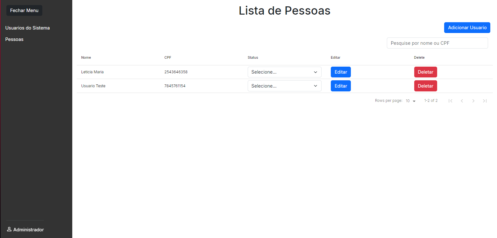

## Registro de clientes

Projeto fullstack com interface simples onde ajuda e auxilia o usuario a inserir dados rápidos de clientes de empresas.

OBS: Esse projeto está bem no começo tendo algumas falhas para corrigir, mas funcional.



Link do projeto: https://register-clients.vercel.app

```
Tecnologias utilizadas: React, Bootstrap, Nodejs (Express).

Bibliotecas: react-loader-spinner, react-datatable, bootstrap-icons.
```

Como rodar o projeto localmente?

instalar dependencias node.

```
npm i
```

Iniciar a aplicação.

```
npm run dev
```